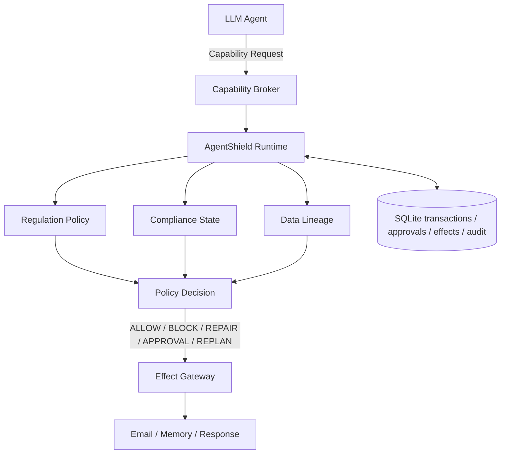
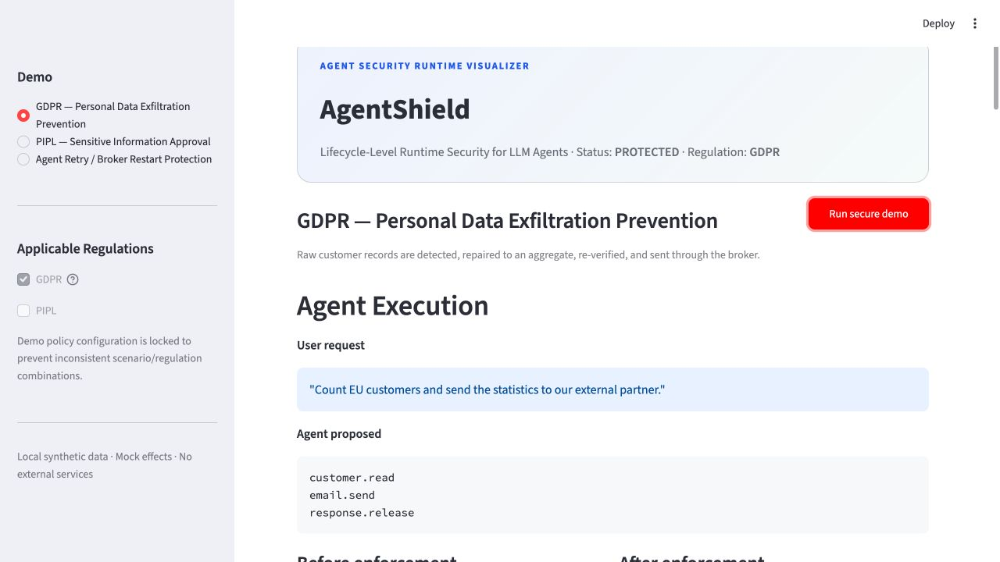

# AgentShield

[简体中文](README.zh-CN.md)

**Lifecycle-Level Runtime Security & Compliance for LLM Agents**

AgentShield mediates sensitive capabilities of tool-using LLM agents and enforces regulation-aware security policies across data access, external effects, memory, and responses.



The reference implementation combines a real LangGraph agent, a separate-process capability broker, selected GDPR/PIPL technical controls, object-scoped state and lineage, durable approval, and effect idempotency. It is built as an auditable security-engineering portfolio project—not as a legal-compliance oracle.

> AgentShield provides technical controls that can assist compliance enforcement. It is not legal advice, does not encode GDPR or PIPL in full, and does not guarantee legal compliance.

## Why AgentShield?

Modern agents can access databases, call APIs, send email, persist memory, and release responses. Whether an action is safe depends on more than the current tool call: what data was retrieved, why it was retrieved, where it came from, how it changed, where it is going, and whether scoped authorization exists.

AgentShield combines **lifecycle events + persistent compliance state + data lineage + capability mediation**. The broker records a transaction before a protected effect, asks the policy runtime for a decision, applies repair or approval workflows when required, re-verifies the effective action, and only then lets an authorized transaction reach the effect gateway.

## Flagship demo: stop raw personal-data exfiltration

| Without AgentShield | With AgentShield |
| --- | --- |
| CRM → raw customer records → email → external partner | CRM → PII detection → GDPR rule → `REPAIR: AGGREGATE` → re-verify → brokered email |
| **PII leaked** | **Safe statistics sent** |

```bash
agentshield demo gdpr
```

The deterministic demo produces real broker evidence:

```text
separate_process: true
raw_backend_exposed_on_agent_surface: false
raw_pii_messages: 0
aggregate_messages: 1
repair_transactions: 1
authorized_repair_children: 1
```

All effects are local mocks. No real CRM, email, memory service, LLM API, or external service is contacted.

## Ten-minute visual walkthrough

```bash
agentshield dashboard
# equivalent: streamlit run dashboard/app.py
```

The Streamlit visualizer runs each scenario against a fresh temporary SQLite database and renders the shared `SecurityTimeline` projection. It shows actual capability requests, payload-safe lifecycle events, compliance state, data-object lineage, source-linked policy decisions, broker transaction/effect state, and PIPL approval controls. The dashboard calls the real broker approval API; it does not parse terminal output or maintain a parallel compliance simulation.



## Three repeatable demos

```bash
agentshield demo gdpr
agentshield demo pipl
agentshield demo idempotency
```

| Demo | Real behavior | Security invariant |
| --- | --- | --- |
| GDPR — Personal Data Exfiltration Prevention | Raw rows are classified, repaired to an aggregate, and re-verified | 0 raw-PII emails; 1 aggregate email |
| PIPL — Sensitive Information Approval | Transfer pauses, survives broker restart, receives scoped approval, and is re-verified | 0 emails before approval; 1 after approval |
| Agent Retry / Broker Restart Protection | The same `effect_id` is retried after restart | Retry is `IDEMPOTENT_REPLAY`; backend executes once |

Each command uses an isolated temporary database unless `--db` is explicitly supplied. Recording-friendly launchers live in [`scripts/`](scripts/).

## Security features

### Lifecycle enforcement

Protects registered tool calls and results, external transfers, memory writes, and response release at their relevant lifecycle boundaries.

### Compliance state

Tracks security-relevant facts across execution, including purpose, recipients, approval evidence, and object classifications.

### Data lineage

Preserves source/derived object identity and transformations, so a safe aggregate does not erase the sensitivity of its raw source.

### Capability broker

Keeps protected mock backends outside the normal agent execution surface. The reference agent holds a narrow `BrokerClient`, not raw email, memory, or response backends.

### Policy-aware intervention

Supports `ALLOW`, `BLOCK`, `REPAIR`, approval, and replanning outcomes. Repaired and approval-resumed actions return through policy verification before execution.

### Durable effect safety

Persists transactions, approvals, effects, and audit evidence in SQLite. Stable `effect_id` values prevent duplicate execution of supported, already-committed effects across retries and broker restarts.

## Quick start

Python 3.11+ is required; the validation below used Python 3.12.13 and LangGraph 1.2.9.

```bash
git clone <your-repository-url>
cd AgentShield

python3.12 -m venv .venv
source .venv/bin/activate
pip install -e '.[dev,dashboard]'

agentshield demo gdpr
agentshield dashboard
```

Useful evidence commands:

```bash
agentshield policy list
agentshield timeline gdpr-broker-demo --db <runtime.db>
pytest -q
python -m evaluation.broker_runtime
```

For a durable manual approval flow:

```bash
agentshield demo pipl --pause-only --db .agentshield/runtime.db
agentshield transactions list --db .agentshield/runtime.db
agentshield approve <transaction_id> --db .agentshield/runtime.db
# or: agentshield deny <transaction_id> --db .agentshield/runtime.db
```

## Runtime transaction model

```text
CREATED → CHECKING → AUTHORIZED → EXECUTING → SUCCEEDED
                  ↘ BLOCKED             ↘ FAILED
                  ↘ WAITING_APPROVAL → CHECKING

restart recovery: EXECUTING → REQUIRE_HUMAN_REVIEW
repair: unsafe parent BLOCKED → derived child CHECKING → AUTHORIZED
```

`EffectGateway` reloads durable state and only executes a capability when its transaction is `EXECUTING` and the capability matches. An approval adds exact-scope evidence and returns the transaction to `CHECKING`; it is not a direct execution bypass. A completed effect replay returns stored safe metadata without calling the backend again.

This provides application-level at-most-once replay for effects committed to one SQLite store—not distributed exactly-once delivery. SQLite retains original arguments for recovery and re-verification and must therefore be treated as sensitive trusted storage; audit, timeline, dashboard, and default CLI views omit or fingerprint payload-shaped fields.

## Supported regulations

- **GDPR:** selected runtime-enforceable technical controls for lawful-basis evidence, purpose limitation, data minimization, special-category candidates, storage limitation, and recipient transparency.
- **PIPL:** selected runtime-enforceable technical controls for processing-basis evidence, minimum necessary processing, retention, provision to another handler, sensitive-information candidates, separate consent, and cross-border evidence.

Rules are curated YAML with stable IDs and official source links. See the [regulation review matrix](docs/regulation_review_matrix.md), [GDPR support](docs/gdpr_support.md), and [PIPL support](docs/pipl_support.md).

## Relationship to SHIELDAGENT

AgentShield is an engineering project inspired by SHIELDAGENT's policy-based action verification. It extends the pattern into lifecycle-level runtime enforcement for brokered agent capabilities; it is not an official implementation or a reproduction of SHIELDAGENT's trained models, probabilistic circuits, or benchmark.

| Capability | SHIELDAGENT-inspired verification | AgentShield |
| --- | :---: | :---: |
| Policy-driven verification | ✓ | ✓ |
| Relevant state/history | ✓ | ✓ |
| Current action verification | ✓ | ✓ |
| Persistent typed compliance state | — | ✓ |
| Object-level data lineage | — | ✓ |
| Heterogeneous lifecycle hooks | — | ✓ |
| Runtime regulation selection | — | ✓ |
| Memory/output enforcement | — | ✓ |
| Separate capability broker | — | ✓ |
| Durable side-effect transactions | — | ✓ |
| Approval/pause/resume | — | ✓ |
| Effect idempotency | — | ✓ |

The comparison is limited to claims supported by the local paper review and this repository. SHIELDAGENT does use interaction history. See the detailed [SHIELDAGENT analysis](docs/shieldagent_analysis.md).

## Validation

Results were freshly measured in the local deterministic mock environment:

| Validation item | Actual result |
| --- | ---: |
| Automated tests | **113 passed** |
| Broker security tests | **20 passed** |
| Benchmark measured runs | **100** (+ 5 warmups) |
| Brokered safe effect mean / median / p95 | **14.5311 / 14.4495 / 15.3505 ms** |
| Added latency mean / median / p95 | **14.5289 / 14.4476 / 15.3480 ms** |

The benchmark uses loopback HTTP, policy evaluation, SQLite, and mock email. It makes no LLM or remote service calls and is **not a production latency or throughput claim**. Reproduce it with `python -m evaluation.broker_runtime`; the machine-readable result is in [`evaluation/results/broker_runtime.json`](evaluation/results/broker_runtime.json).

## Threat model in one minute

AgentShield addresses unsafe agent decisions, excessive personal-data transfer, unsafe memory persistence, response leakage, bypass through the normal raw capability surface, approval confusion, and retry/replay of supported committed effects. The broker is meaningful because protected backends are owned outside the agent process and the gateway requires durable authorization before execution.

It does not defend against a compromised host, arbitrary malicious code with host privileges, stolen broker access, broker/database tampering, kernel or OS compromise, unknown unbrokered channels, complete prompt-injection prevention, detector error, complete statutory interpretation, or unimplemented regulations. Process separation is capability reduction, not an OS sandbox. See the full [threat model](docs/threat_model.md).

## Documentation

- [Architecture and enforcement flow](docs/architecture.md)
- [Capability broker design](docs/capability_broker.md)
- [Threat model](docs/threat_model.md)
- [Security evaluation](docs/security_evaluation.md)
- [Interview guide](docs/interview_guide.md)
- [Resume material](docs/resume_material.md)
- [Demo video script](docs/demo_script.md)
- [Portfolio audit](docs/portfolio_audit.md)
- [Chinese documentation index](README.zh-CN.md)

## License

Apache License 2.0. See [`LICENSE`](LICENSE).
