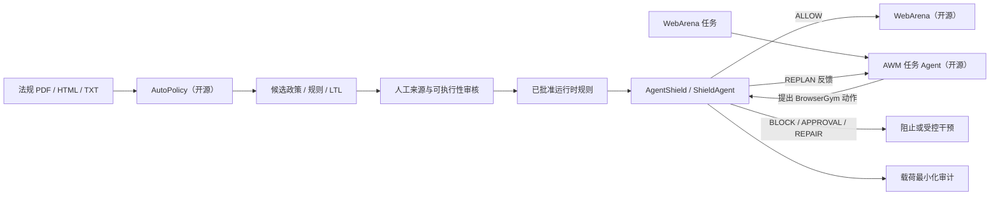

# AgentShield

**面向 Web Agent 的法规驱动运行时防护 Agent**

本仓库只实现 ShieldAgent 防护层。论文实验中的其他部分直接使用并固定到开源上游：

- **AutoPolicy**：法规/平台政策文档解析，结构化政策、自然语言规则与 LTL 候选规则抽取；
- **Agent Workflow Memory（AWM）**：被保护的 Web 任务 Agent；
- **WebArena**：Shopping、Shopping Admin、Reddit、GitLab、Map 等真实可部署 Web 环境；
- **AgentShield**：动作规则电路检索、谓词赋值、形式核验、重新规划、阻断、修复、审批与审计。



> AgentShield 是安全工程参考实现，不构成法律意见。LLM 抽取结果是候选规则，不会自动取得法律权威或直接进入执行面。

## 项目边界

| 组件 | 来源 | 本仓库是否重新实现 | 责任 |
| --- | --- | :---: | --- |
| 法规文档解析与规则抽取 | AutoPolicy | 否 | 输出结构化政策、规则、风险分类、来源映射与可选 LTL |
| Web 任务 Agent | AWM | 否 | 根据 WebArena 观察生成 BrowserGym 动作 |
| Web 网站与浏览器环境 | WebArena | 否 | 提供可部署网站、任务与环境状态 |
| 防护 Agent | AgentShield | **是** | 在动作到达 `env.step()` 前核验、反馈、修复或阻断 |
| Capability Broker | AgentShield | **是** | 保护本地能力、副作用事务、审批、幂等与审计 |

过去的 Northstar Market 和自研 LangGraph Web 任务 Agent 仅保留为快速单元测试夹具，不再代表论文复现场景，也不是面向用户的主执行路径。

## 固定的开源版本

仓库通过 Git submodule 固定上游，不复制或改写上游源码：

| 上游 | Revision | 许可证 |
| --- | --- | --- |
| AutoPolicy | `7f02c713aa7f2541e2bdd40a47d5ecaf19ec880f` | MIT |
| Agent Workflow Memory | `8c0ff8cd11d648c8fceb99e4e42f37e3b75381b1` | Apache-2.0 |
| WebArena | `dce04686a56253aefba7b18a4fa0937cf1dc987b` | Apache-2.0 |

运行 `agentshield upstream status` 会同时检查目录、入口文件和 commit；版本漂移时状态为 `NOT_READY`，不会静默使用未经验证的上游。

## 法规文档到规则

实现严格跟随论文与开放 AutoPolicy 的数据链：

```text
政策文档
  -> 文本与文档结构抽取
  -> 结构化政策：definitions / scope / policy_description / reference
  -> 原子自然语言规则：rule_description / source_policy_idx
  -> 风险分类与 policy-rule mapping
  -> 可选 LTL 候选：predicates / description / ltl_formula / rule_type
  -> AgentShield schema、来源、哈希与关联完整性校验
  -> REVIEW_REQUIRED
  -> 人工确认来源、语义、可观察谓词、干预方式
  -> 运行时规则包
```

导入器会拒绝缺少来源、重复 ID、未知 policy-rule 引用、错误 JSON 和过大文件。整个 bundle 会计算 SHA-256，并记录 AutoPolicy revision。候选结果的 `executable` 固定为 `false`；只有经过审核并绑定到可信运行时变量的规则包才能被 ShieldAgent 使用。

固定上游存在两个必须透明披露的约束：自然语言政策/规则抽取器当前在源码中固定使用 Claude，LTLRuleExtractor 固定使用 GPT-4o。API Key 只从 `ANTHROPIC_API_KEY` / `OPENAI_API_KEY` 环境变量读取，不进入命令参数、Git 或审计日志。

```bash
# 查看固定上游
agentshield upstream status

# 按开放 AutoPolicy 运行政策与自然语言规则抽取
export ANTHROPIC_API_KEY='...'
agentshield autopolicy extract ./regulation.pdf \
  --organization 'Example Regulation' \
  --input-type pdf \
  --output-dir .agentshield/autopolicy

# 同时运行开放版本中的 GPT-4o LTLRuleExtractor
export OPENAI_API_KEY='...'
agentshield autopolicy extract ./regulation.pdf \
  --organization 'Example Regulation' \
  --input-type pdf \
  --extract-ltl

# 对已有输出进行离线校验；不会调用模型
agentshield autopolicy inspect .agentshield/autopolicy/extraction_YYYYMMDD_HHMMSS

# 导出不可执行的人工审核模板；审核前不会激活为运行时规则
agentshield autopolicy review-template \
  .agentshield/autopolicy/extraction_YYYYMMDD_HHMMSS \
  --output .agentshield/review/example-regulation.yaml
```

详见[开源组件与集成说明](docs/upstream_integration.zh-CN.md)。

## AWM 动作如何被保护

`ShieldedBrowserAgent` 组合原始 AWM Agent，不修改 AWM 源码：

1. AWM 的 `get_action(observation)` 产生 BrowserGym 高层动作；
2. AgentShield 解析动作名称、目标、页面证据、任务目的和可能的数据载荷；
3. ShieldAgent 检索相关动作规则电路并为原子谓词赋值；
4. 确定性校验返回 `ALLOW / REPLAN / BLOCK / REQUIRE_APPROVAL / REQUIRE_CONSENT / REPAIR`；
5. `ALLOW` 才把动作交给 WebArena；不安全动作永远不会到达 `env.step()`；
6. `REPLAN` 作为 `last_action_error` 反馈给原 AWM，最多重新规划指定次数；
7. 需要用户亲自处理时生成有范围和时效的 `PENDING_USER` 检查点，验证用户完成凭证后以独立轨迹续跑；
8. 仍不安全时返回 BrowserGym 安全终止消息，并写入载荷最小化审计。

这比论文开放仓库中只读取轨迹最后一步的事后脚本更适合真实运行时：检查点明确位于 Agent 输出与环境副作用之间。

## 运行 AWM + WebArena

WebArena 是多站点自托管环境，需要 Docker、站点镜像和 BrowserGym 依赖；本仓库不会用一个假购物页冒充它。

```bash
git clone --recurse-submodules https://github.com/stellasuc/AgendShield.git
cd AgendShield

python3.12 -m venv .venv
source .venv/bin/activate
pip install -e '.[dev,dashboard]'

# AWM 使用旧版 LangChain 和 BrowserGym 0.3 API，安装到独立环境；不会修改上游 submodule
AGENTSHIELD_PYTHON=python3.11 ./scripts/setup_paper_stack.sh

# 按 third_party/webarena/environment_docker/README.md 部署站点后配置 URL
export SHOPPING='http://...'
export SHOPPING_ADMIN='http://...'
export REDDIT='http://...'
export GITLAB='http://...'
export MAP='http://...'
export WIKIPEDIA='http://...'
export HOMEPAGE='http://...'
export OPENAI_API_KEY='...'

agentshield webarena status
agentshield webarena run webarena.0 \
  --workflow shopping \
  --model openai/gpt-4o \
  --regulations GDPR

# 或把用户自己的 Prompt 注入 BrowserGym 的 openended 任务，起始页指向已部署的 WebArena 站点。
# 该模式使用真实 WebArena 网站，但不等同于官方 WebArena 基准任务。
agentshield webarena run openended \
  --workflow shopping \
  --start-url "$SHOPPING" \
  --prompt '寻找预算内评分最高的降噪耳机并加入购物车，不要下单。' \
  --model openai/gpt-4o \
  --regulations GDPR
```

CLI 和页面会优先使用 `.venv-awm/bin/python`。AWM 固定版本通过 LangChain `ChatOpenAI` 调用模型。OpenAI 兼容服务可通过其标准环境变量接入，但应先在目标模型上验证 AWM 的动作格式和视觉能力；这与 AutoPolicy 的固定模型约束是两件不同的事。

`webarena.<id>` 运行官方 WebArena 基准任务；`openended` 是 BrowserGym 的通用任务环境，允许客户用自己的 Prompt 操作已部署的 WebArena 站点。两者共用 AWM 与 ShieldAgent，但只有前者可以用于官方基准指标对比。

## ShieldAgent 实现

本仓库实现的防护面包括：

- 动作相关规则电路检索；
- `TRUE / FALSE / UNKNOWN` 原子谓词赋值；
- fail-closed 的确定性 LTL 风格核验；
- Search、Binary-Check、Detect、Formal Verify 的可扩展操作接口；
- 不安全动作反馈与 AWM 重新规划；
- 用户接管检查点、限时完成凭证与安全续跑；
- 生命周期状态、数据分类和对象级血缘；
- 外部传输、记忆、日志、响应与副作用前置防护；
- Broker 进程隔离、持久化审批、修复重验和副作用幂等；
- 不记录原始动作载荷的审计证据。

当前没有声称复现论文训练得到的 ASPM 软权重、MLN 概率推理、微调验证模型或论文基准成绩。详见 [SHIELDAGENT 技术分析](docs/shieldagent_analysis.zh-CN.md)。

## 本地快速验证

无需部署 WebArena，即可验证我们负责的防护代码和 Broker 不变量：

```bash
pytest -q
agentshield demo gdpr
agentshield demo pipl
agentshield demo idempotency
agentshield dashboard
```

上述 demo 使用合成数据和本地测试后端，仅用于验证 ShieldAgent/Broker，不代表 AWM/WebArena 实验。当前自动化结果为 **150 passed**，其中测试覆盖：上游 commit 锁定、AutoPolicy 来源关联、policy-rule mapping 一致性、损坏 artifact 拒绝、Key 不进入 argv、AWM 反馈重规划、含个人数据的 BrowserGym 动作在环境执行前被阻止，以及用户接管检查点的范围、时效、单次使用和载荷最小化。

## 支持的审核后规则包

- **GDPR**：处理依据、目的限制、数据最小化、特殊类别候选、保存期限、接收方透明度等部分技术控制；
- **PIPL**：处理依据、最小必要、保存期限、向其他处理者提供、敏感信息候选、单独同意和跨境证据等部分技术控制。

这些是人工审核后的工程控制，不宣称完整覆盖法规。参见[法规审查矩阵](docs/regulation_review_matrix.zh-CN.md)、[GDPR 支持](docs/gdpr_support.zh-CN.md)与 [PIPL 支持](docs/pipl_support.zh-CN.md)。

## 文档

- [开源组件与集成说明](docs/upstream_integration.zh-CN.md)
- [架构与执行流](docs/architecture.zh-CN.md)
- [SHIELDAGENT 技术分析](docs/shieldagent_analysis.zh-CN.md)
- [Capability Broker](docs/capability_broker.zh-CN.md)
- [威胁模型](docs/threat_model.zh-CN.md)
- [安全评估](docs/security_evaluation.zh-CN.md)
- [面试指南](docs/interview_guide.zh-CN.md)
- [简历素材](docs/resume_material.zh-CN.md)

## 许可证

AgentShield 自有代码使用 Apache License 2.0。三个 submodule 保留各自许可证与版权，详见[第三方声明](THIRD_PARTY_NOTICES.zh-CN.md)。
