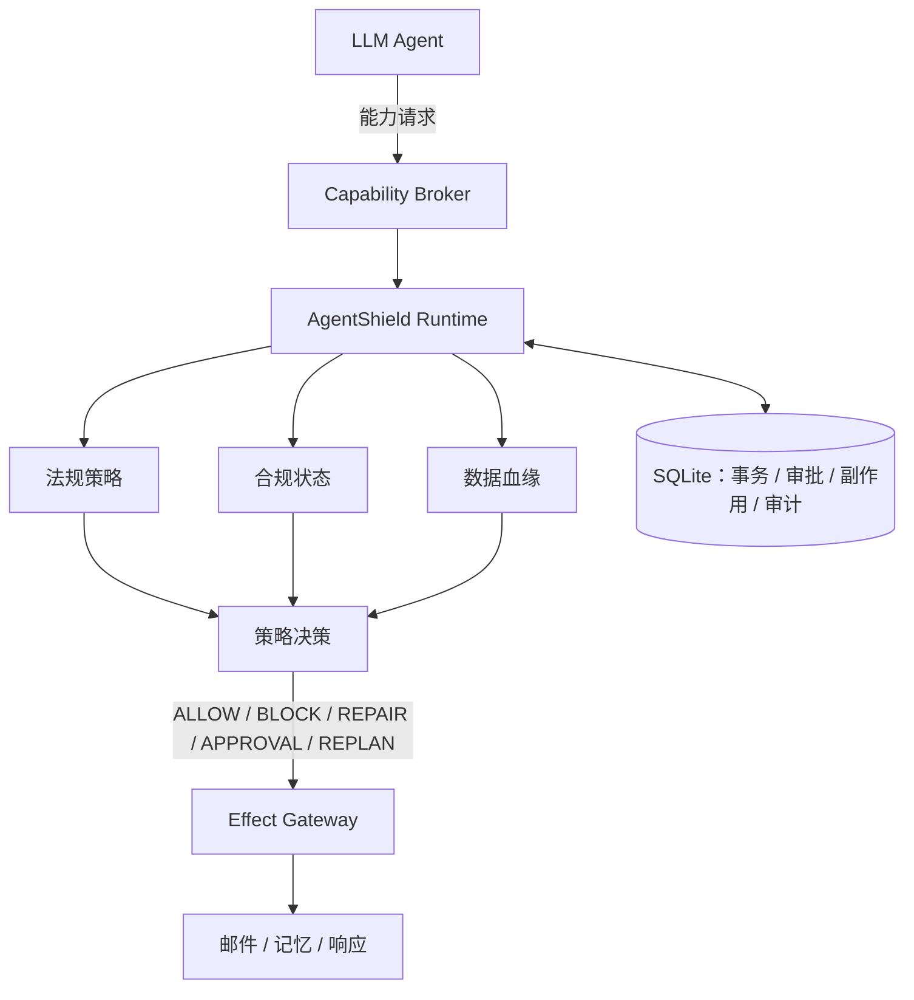

# AgentShield

[English](README.md)

**面向 LLM Agent 的生命周期级运行时安全与合规控制**

AgentShield 对工具型 LLM Agent 的敏感能力进行中介，并在数据访问、外部副作用、记忆写入与响应发布的完整生命周期中执行法规感知的安全策略。



参考实现包含真实 LangGraph Agent、独立进程 Capability Broker、GDPR/PIPL 部分技术控制、对象级状态与血缘、持久化审批和副作用幂等。它是一个可审计的安全工程求职项目，而不是法律合规判定器。

> AgentShield 提供可辅助合规执行的技术控制。它不构成法律意见，不完整编码 GDPR 或 PIPL，也不保证法律合规。

## 为什么需要 AgentShield？

现代 Agent 可以访问数据库、调用 API、发送邮件、持久化记忆和发布响应。一个动作是否安全，不只取决于当前工具调用，还取决于此前取得了什么数据、取得目的、数据来源、发生过哪些转换、数据将去往哪里，以及是否存在限定范围的授权。

AgentShield 组合了**生命周期事件 + 持久化合规状态 + 数据血缘 + 能力中介**。Broker 在受保护副作用发生前记录事务并调用策略运行时；必要时执行修复或审批流程，对生效动作重新校验，最后才允许已授权事务到达 Effect Gateway。

## 旗舰演示：阻止原始个人数据外泄

| 未使用 AgentShield | 使用 AgentShield |
| --- | --- |
| CRM → 原始客户记录 → 邮件 → 外部合作方 | CRM → PII 检测 → GDPR 规则 → `REPAIR: AGGREGATE` → 重新校验 → Broker 邮件 |
| **PII 泄露** | **只发送安全统计结果** |

```bash
agentshield demo gdpr
```

确定性演示会产生真实 Broker 证据：

```text
separate_process: true
raw_backend_exposed_on_agent_surface: false
raw_pii_messages: 0
aggregate_messages: 1
repair_transactions: 1
authorized_repair_children: 1
```

所有副作用均为本地 Mock；不会连接真实 CRM、邮件、记忆、LLM API 或其他外部服务。

## 十分钟可视化体验

```bash
agentshield dashboard
# 等价命令：streamlit run dashboard/app.py
```

Streamlit 可视化器为每个场景创建全新的临时 SQLite 数据库，并渲染共享的 `SecurityTimeline` 投影。界面展示真实能力请求、载荷安全的生命周期事件、合规状态、数据对象血缘、带法规来源的策略决策、Broker 事务/副作用状态，以及 PIPL 审批控件。Dashboard 调用真实 Broker 审批 API，不解析终端输出，也不维护平行的合规模拟逻辑。


## 三个可重复旗舰演示

```bash
agentshield demo gdpr
agentshield demo pipl
agentshield demo idempotency
```

| 演示 | 真实行为 | 安全不变量 |
| --- | --- | --- |
| GDPR — 防止个人数据外泄 | 原始记录被分类、聚合修复并重新校验 | 原始 PII 邮件 0 封；聚合邮件 1 封 |
| PIPL — 敏感信息审批 | 传输持久暂停、Broker 重启、限定审批并重新校验 | 审批前邮件 0 封；审批后 1 封 |
| Agent 重试 / Broker 重启保护 | 重启后再次提交同一个 `effect_id` | 返回 `IDEMPOTENT_REPLAY`；后端只执行 1 次 |

未显式提供 `--db` 时，每条命令都使用隔离临时数据库。适合录屏的启动脚本位于 [`scripts/`](scripts/)。

## 六项核心安全能力

### 生命周期强制执行

在相应生命周期边界保护已注册工具调用与结果、外部传输、记忆写入和响应发布。

### 合规状态

跨执行过程记录目的、接收方、审批证据和数据对象分类等安全事实。

### 数据血缘

保留源对象、派生对象和转换关系；安全聚合不会抹除原始来源的敏感属性。

### Capability Broker

将受保护 Mock 后端移出 Agent 的正常执行面。参考 Agent 只持有窄接口 `BrokerClient`，不持有原始邮件、记忆或响应后端。

### 策略感知干预

支持 `ALLOW`、`BLOCK`、`REPAIR`、审批和重新规划。修复动作与审批恢复动作都必须再次通过策略校验。

### 持久化副作用安全

在 SQLite 中持久化事务、审批、副作用和审计证据。稳定 `effect_id` 可避免已提交且受支持的副作用在重试或 Broker 重启后重复执行。

## 快速开始

需要 Python 3.11+；下方验证使用 Python 3.12.13 与 LangGraph 1.2.9。

```bash
git clone <你的仓库地址>
cd AgentShield

python3.12 -m venv .venv
source .venv/bin/activate
pip install -e '.[dev,dashboard]'

agentshield demo gdpr
agentshield dashboard
```

常用证据命令：

```bash
agentshield policy list
agentshield timeline gdpr-broker-demo --db <runtime.db>
pytest -q
python -m evaluation.broker_runtime
```

持久化人工审批流程：

```bash
agentshield demo pipl --pause-only --db .agentshield/runtime.db
agentshield transactions list --db .agentshield/runtime.db
agentshield approve <transaction_id> --db .agentshield/runtime.db
# 或：agentshield deny <transaction_id> --db .agentshield/runtime.db
```

## 运行时事务模型

```text
CREATED → CHECKING → AUTHORIZED → EXECUTING → SUCCEEDED
                  ↘ BLOCKED             ↘ FAILED
                  ↘ WAITING_APPROVAL → CHECKING

重启恢复：EXECUTING → REQUIRE_HUMAN_REVIEW
修复：不安全父事务 BLOCKED → 派生子事务 CHECKING → AUTHORIZED
```

`EffectGateway` 会重新读取持久状态，并且只在事务处于 `EXECUTING` 且能力名称匹配时执行。审批只会增加精确范围的证据并使事务回到 `CHECKING`，不会绕过校验直接执行。已完成副作用的重放只返回已保存的安全元数据，不再次调用后端。

这是针对单个 SQLite 存储中已提交副作用的应用层至多一次重放控制，不是分布式“精确一次”交付。为了恢复与重新校验，SQLite 会保存原始参数，因此它是敏感可信存储；审计、时间线、Dashboard 和默认 CLI 视图都会删除载荷字段或仅展示指纹。

## 支持的法规

- **GDPR：**部分可在运行时执行的技术控制，包括处理依据证据、目的限制、数据最小化、特殊类别候选、存储期限和接收方透明度。
- **PIPL：**部分可在运行时执行的技术控制，包括处理依据证据、最小必要、保存期限、向其他处理者提供、敏感信息候选、单独同意和跨境证据。

规则采用带稳定 ID 与官方来源链接的人工审查 YAML。参见[法规审查矩阵](docs/regulation_review_matrix.zh-CN.md)、[GDPR 支持](docs/gdpr_support.zh-CN.md)与 [PIPL 支持](docs/pipl_support.zh-CN.md)。

## 与 SHIELDAGENT 的关系

AgentShield 是受 SHIELDAGENT 策略驱动动作校验启发的独立工程项目，并将这一模式扩展为针对 Broker 化 Agent 能力的生命周期级运行时强制执行。它不是官方实现，也没有复现 SHIELDAGENT 的训练模型、概率电路或评测基准。

| 能力 | SHIELDAGENT 启发的校验 | AgentShield |
| --- | :---: | :---: |
| 策略驱动校验 | ✓ | ✓ |
| 使用相关状态/历史 | ✓ | ✓ |
| 当前动作校验 | ✓ | ✓ |
| 持久化类型化合规状态 | — | ✓ |
| 对象级数据血缘 | — | ✓ |
| 异构生命周期钩子 | — | ✓ |
| 运行时法规选择 | — | ✓ |
| 记忆/输出强制执行 | — | ✓ |
| 独立 Capability Broker | — | ✓ |
| 持久化副作用事务 | — | ✓ |
| 审批/暂停/恢复 | — | ✓ |
| 副作用幂等 | — | ✓ |

该对比只包含本地论文审阅与当前仓库能够支持的表述。SHIELDAGENT 确实会使用交互历史。详见 [SHIELDAGENT 分析](docs/shieldagent_analysis.zh-CN.md)。

## 实际验证结果

以下结果均在本地确定性 Mock 环境中重新测量：

| 验证项 | 实际结果 |
| --- | ---: |
| 自动化测试 | **113 passed** |
| Broker 安全专项测试 | **20 passed** |
| 基准实测次数 | **100**（另有 5 次预热） |
| Broker 安全副作用平均 / 中位数 / p95 | **14.5311 / 14.4495 / 15.3505 ms** |
| 新增延迟平均 / 中位数 / p95 | **14.5289 / 14.4476 / 15.3480 ms** |

基准包含本机回环 HTTP、策略计算、SQLite 与 Mock 邮件，不包含 LLM 或远程服务调用，**不是生产延迟或吞吐量声明**。可运行 `python -m evaluation.broker_runtime` 复现；机器可读结果位于 [`evaluation/results/broker_runtime.json`](evaluation/results/broker_runtime.json)。

## 一分钟威胁模型

AgentShield 处理不安全 Agent 决策、个人数据过度传输、不安全记忆持久化、响应泄露、从正常原始能力面绕过、审批范围混淆，以及已提交且受支持副作用的重试/重放。Broker 的价值在于受保护后端由 Agent 进程之外持有，并且 Gateway 要求持久化授权后才能执行。

不在范围内：主机失陷、具有主机权限的任意恶意代码、Broker 访问能力被盗、Broker/数据库篡改、内核或 OS 攻陷、未知的非 Broker 通道、完整防御 Prompt Injection、检测器错误、完整法律解释和未实现法规。进程隔离是能力缩减，不是 OS 沙箱。详见[威胁模型](docs/threat_model.zh-CN.md)。

## 文档

- [架构与执行流](docs/architecture.zh-CN.md)
- [Capability Broker 设计](docs/capability_broker.zh-CN.md)
- [威胁模型](docs/threat_model.zh-CN.md)
- [安全评估](docs/security_evaluation.zh-CN.md)
- [面试指南](docs/interview_guide.zh-CN.md)
- [简历素材](docs/resume_material.zh-CN.md)
- [演示视频脚本](docs/demo_script.zh-CN.md)
- [求职作品审计](docs/portfolio_audit.zh-CN.md)

## 许可证

Apache License 2.0，参见 [`LICENSE`](LICENSE)。
