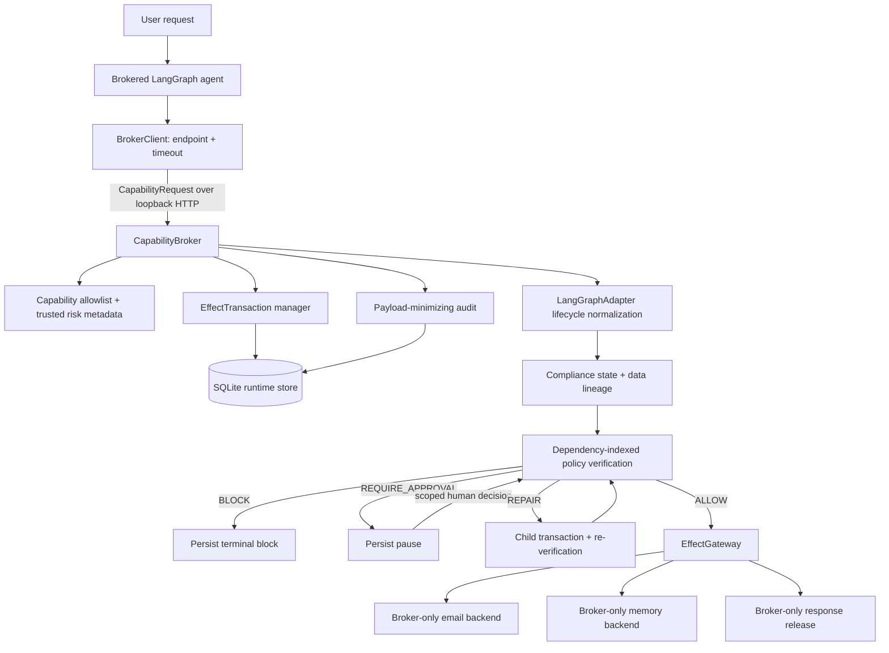
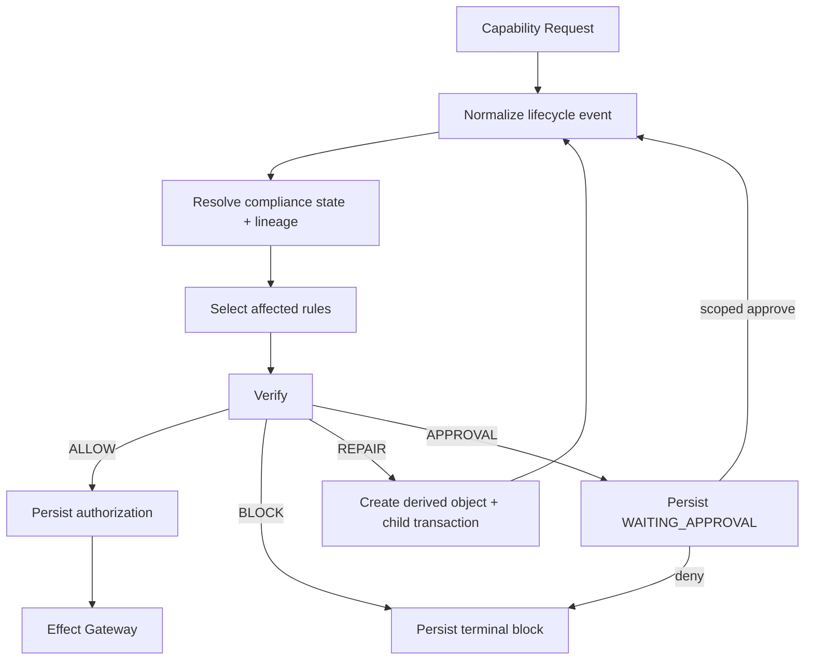

# AgentShield architecture

[简体中文](architecture.zh-CN.md)

## Runtime structure

The current architecture keeps the framework-neutral policy engine and moves raw effect authority into a separate capability-broker process.



The agent owns no `ToolRegistry`, `EffectGateway`, raw email object, or raw memory object. Its business runtime maps planned tool names to four typed broker capabilities. The service is a standard-library `ThreadingHTTPServer` bound to loopback and launched with `multiprocessing` using the spawn start method.

## Enforcement flow



The Streamlit dashboard is a read/control surface over this architecture. It runs the real demos, reads the same SQLite evidence through `SecurityTimeline`, and sends approval decisions through the public broker API; it contains no independent policy engine.

## Request path

1. The client submits `request_id`, `trajectory_id`, `capability_id`, arguments, referenced data-object IDs, and optional `effect_id`.
2. The broker rejects capabilities absent from the fixed registry.
3. For side effects, it checks the durable effects table for a previously successful `effect_id`.
4. It persists a `CREATED` transaction and payload-minimized audit event, then enters `CHECKING`.
5. The existing adapter normalizes the proposal, resolves classifications/lineage, and invokes the existing deterministic policy engine.
6. Block/approval/repair decisions are persisted before any gateway call.
7. Only an allowed, matching transaction becomes `EXECUTING` and is accepted by `EffectGateway`.
8. The effect and final `SUCCEEDED`/`FAILED` state are persisted and returned.

## Transaction state machine

```mermaid
stateDiagram-v2
    [*] --> CREATED
    CREATED --> CHECKING
    CHECKING --> BLOCKED: policy block
    CHECKING --> WAITING_APPROVAL: approval/consent required
    WAITING_APPROVAL --> BLOCKED: denied
    WAITING_APPROVAL --> CHECKING: approved; reverify
    CHECKING --> AUTHORIZED: allow
    AUTHORIZED --> CHECKING: explicit resume; reverify
    AUTHORIZED --> EXECUTING
    EXECUTING --> SUCCEEDED
    EXECUTING --> FAILED
    EXECUTING --> REQUIRE_HUMAN_REVIEW: observed at startup
```



Repair is represented by two records. The original is terminal `BLOCKED` with decision `REPAIR`; a new `AUTHORIZED` child identifies the original through `repair_parent`, contains the effective arguments, and passes a fresh policy evaluation before execution.

The state transition to `EXECUTING` is durable before the gateway call. A crash after that write has an ambiguous outcome, so initialization converts surviving `EXECUTING` records to `REQUIRE_HUMAN_REVIEW`. It does not automatically repeat them.

## Persistent model

SQLite uses WAL mode and a new connection per operation. Four tables form the durable runtime boundary:

| Table | Purpose | Key invariant |
| --- | --- | --- |
| `transactions` | Full policy/effect state and recovery inputs | one row per attempt or repair child |
| `effects` | Successful backend effects and safe replay metadata | `effect_id` is unique |
| `approvals` | Human decision plus exact scope | scope binds objects/purpose/recipient/operation |
| `audit_events` | Ordered broker decision history | arguments and values are fingerprinted |

Transactions intentionally retain original arguments so a restarted broker can reconstruct referenced data objects and re-verify approval. The database is therefore sensitive trusted storage. Audit events and the default transaction CLI view minimize payloads, but SQLite encryption and key management are deployment responsibilities not implemented here.

## Capability and gateway checks

The fixed registry defines whether a capability is a side effect, data source/sink, persistent write, and trust-boundary crossing. Unknown capabilities fail before a transaction is created.

`EffectGateway.execute()` reloads the transaction from SQLite and requires:

1. status exactly `EXECUTING`;
2. transaction capability exactly equal to the requested dispatch capability.

That check prevents ordinary client code from invoking a backend merely by importing a capability name. The reference design is still not an OS security boundary: arbitrary code in the broker process or a compromised host can bypass Python object encapsulation.

## Approval protocol

The expected approval scope is derived from the paused transaction:

```text
data_objects + purpose + recipient + operation
```

The approval manager rejects any mismatched scope before recording it. An accepted decision is persisted, mapped back into lifecycle evidence, and then the original policy proposal is re-evaluated with broker-trusted evidence. Approval does not change the transaction directly from `WAITING_APPROVAL` to `EXECUTING`.

## Idempotency

When the caller omits `effect_id`, the transaction manager derives one from trajectory, capability, canonical arguments, and referenced objects. A successful gateway effect is stored under that ID. A retry—also after service restart—returns `IDEMPOTENT_REPLAY` from the stored safe metadata.

The guarantee is scoped to a single SQLite database and completed effect record. It is not cross-region deduplication or exactly-once coordination with a real external provider.

## In-process compatibility

`AgentShield.wrap()` and `LangGraphAdapter` remain usable for in-process integrations. The broker uses the same adapter and policy engine internally, including lifecycle causality, detection, lineage, repair, response redaction, and regulation packages. The brokered path adds trusted metadata injection, public object hydration, and approval evidence hooks; it does not move legal predicates into the adapter.

## Runtime invariants

1. An unregistered capability creates no transaction and reaches no backend.
2. A registered side effect reaches the gateway only from a matching `EXECUTING` transaction.
3. Policy block and waiting approval occur before gateway execution.
4. Repair uses a child transaction and is re-verified.
5. Approval is exactly scoped and is followed by re-verification.
6. A successful `effect_id` is not executed again in this store.
7. An uncertain in-flight effect is not automatically retried after restart.
8. The normal brokered agent API contains no raw backend handle.
9. Audit and CLI presentation fingerprint payload-shaped values.
