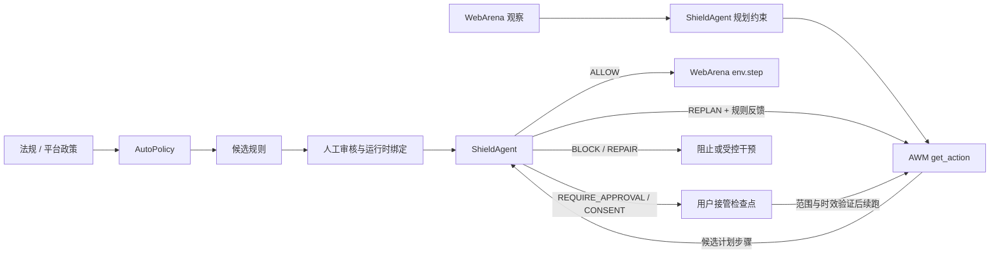
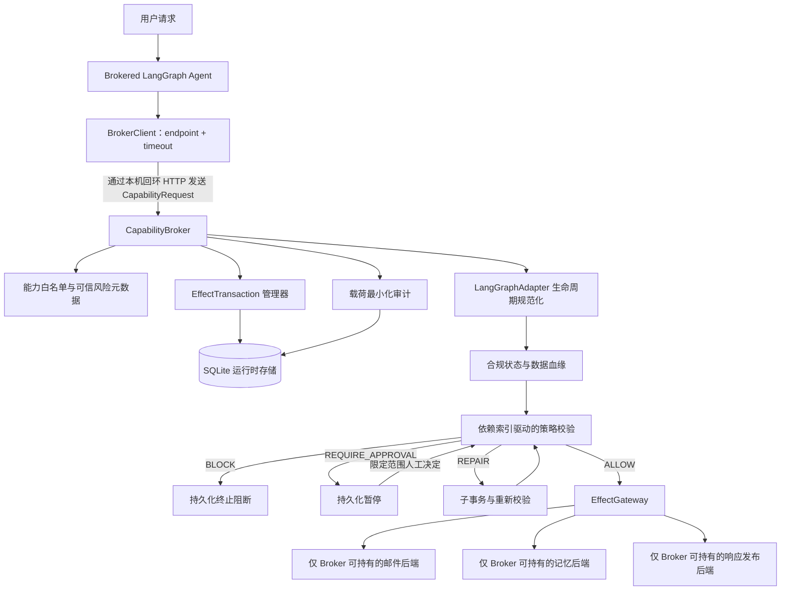
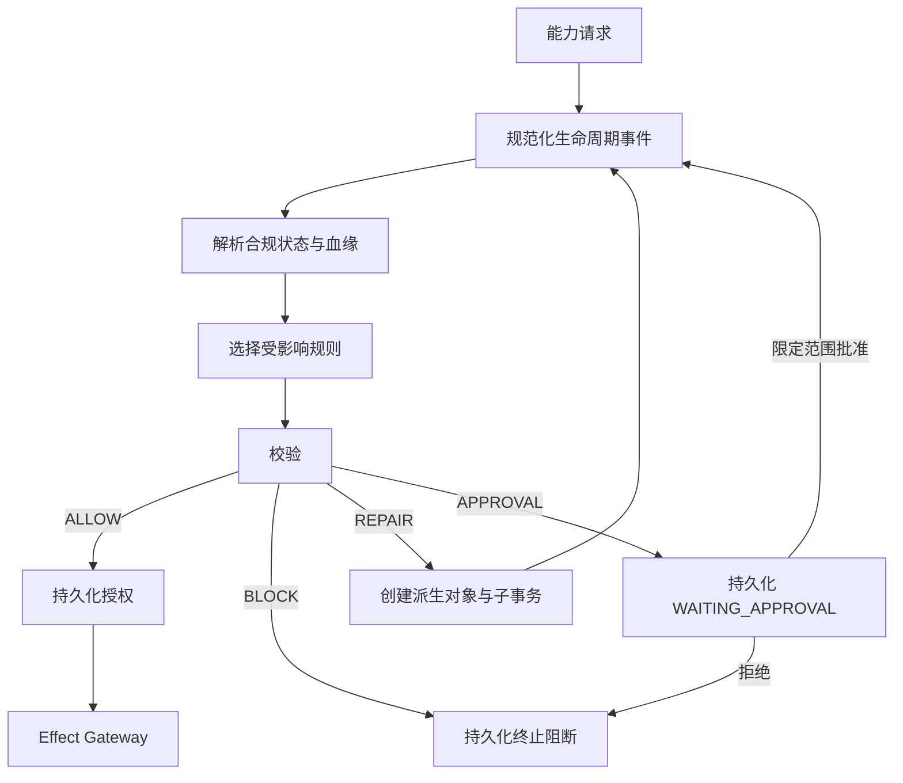
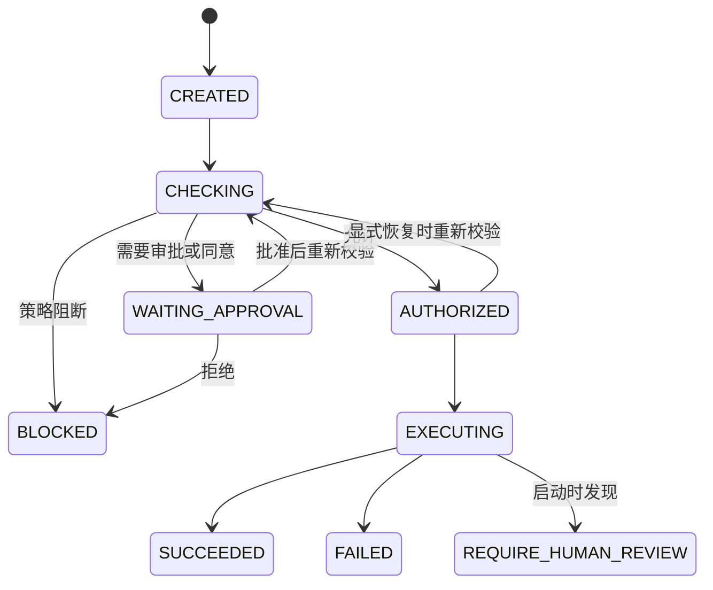

# AgentShield 系统架构

[English](architecture.md)

## 运行时结构

面向论文场景的主路径由三个固定开源上游和一个自研防护层组成。AutoPolicy、AWM 和 WebArena 均通过 submodule 引用；本仓库不改写任务 Agent 或网站，只实现 ShieldAgent 与安全运行时。



`ShieldedBrowserAgent` 是组合适配器：它转发原 AWM 的 observation preprocessor 与 action set。首次规划前，适配器先把所选法规、个人数据最小化、站点范围、能力白名单和高风险副作用边界注入 AWM 的 Goal/Chat 上下文；AWM 生成的每个下一步动作被视为候选计划步骤，经过 AST、预期事件和规则电路核验后，才可能从适配器返回给 BrowserGym。

因此系统采用双层控制：Plan 阶段尽量让 Agent 直接生成合规步骤，`env.step()` 前仍保留不可绕过的确定性执行门。只做 Plan 检查并不充分，因为模型可能偏离原计划，网页状态和动作参数也会在运行期间变化。

对于需要用户亲自处理的个人信息输入或人工确认，`REQUIRE_APPROVAL` 和 `REQUIRE_CONSENT` 会被运行时编排为 `PENDING_USER` 检查点。旧轨迹安全终止；用户完成待办后，Dashboard 校验一次性检查点并保存不含原始载荷的完成凭证，再以独立轨迹继续剩余非敏感步骤。该编排不会把用户证明转换为对原始高风险动作的直接放行。

以下 Capability Broker 路径仍是 ShieldAgent 的本地可重复测试与通用能力防护架构。它保留与框架无关的策略引擎，并将原始副作用权限移入独立 Broker 进程，但不再被描述为 AWM/WebArena 的替代实现。



Agent 不持有 `ToolRegistry`、`EffectGateway`、原始邮件对象或原始记忆对象。其业务运行时只负责将计划中的工具名称映射为四项类型化 Broker 能力。参考服务使用标准库 `ThreadingHTTPServer`，绑定本机回环地址，并通过 `multiprocessing` 的 spawn 启动方式运行。

## 强制执行流程



Streamlit Dashboard 是该架构之上的读取与控制界面。它运行真实演示，通过 `SecurityTimeline` 读取相同 SQLite 证据，并通过公开 Broker API 提交审批决定；其中没有独立策略引擎。

## 请求路径

1. 客户端提交 `request_id`、`trajectory_id`、`capability_id`、参数、引用的数据对象 ID，以及可选的 `effect_id`。
2. Broker 拒绝固定注册表之外的能力。
3. 对于副作用，Broker 首先在持久化 effects 表中查询是否已有成功的 `effect_id`。
4. Broker 持久化 `CREATED` 事务和载荷最小化审计事件，然后进入 `CHECKING`。
5. 现有 Adapter 规范化提案，解析分类与血缘，并调用已有的确定性策略引擎。
6. 阻断、审批或修复决策必须在任何网关调用前持久化。
7. 只有允许且匹配的事务能够进入 `EXECUTING`，并被 `EffectGateway` 接受。
8. 副作用与最终 `SUCCEEDED`/`FAILED` 状态被持久化并返回。

## 事务状态机



修复由两条记录表示。原事务以 `BLOCKED` 终止，决策为 `REPAIR`；新的 `AUTHORIZED` 子事务通过 `repair_parent` 指向原事务，保存生效参数，并在执行前完成新的策略校验。

网关调用前，状态 `EXECUTING` 已经持久化。若进程在该写入后崩溃，副作用结果具有不确定性，因此初始化会把遗留的 `EXECUTING` 事务转为 `REQUIRE_HUMAN_REVIEW`，而不会自动重试。

## 持久化模型

SQLite 使用 WAL 模式，每次操作创建新连接。持久化运行时边界由四张表组成：

| 表 | 用途 | 核心不变量 |
| --- | --- | --- |
| `transactions` | 完整策略/副作用状态与恢复输入 | 每次尝试或修复子事务一行 |
| `effects` | 成功的后端副作用与安全重放元数据 | `effect_id` 唯一 |
| `approvals` | 人工决定与精确范围 | 绑定对象、目的、接收方、操作 |
| `audit_events` | 有序的 Broker 决策历史 | 参数和值被指纹化 |

事务会有意保留原始参数，使重启后的 Broker 能够重建引用对象并重新校验审批。因此数据库属于敏感可信存储。审计事件和默认事务 CLI 视图会最小化载荷，但 SQLite 加密和密钥管理仍是未实现的部署责任。

## 能力与网关检查

固定注册表声明每项能力是否具有副作用、是否为数据源/数据汇、是否写入持久存储、是否跨越信任边界。未知能力在创建事务前失败。

`EffectGateway.execute()` 会从 SQLite 重新加载事务，并要求：

1. 状态严格等于 `EXECUTING`；
2. 事务中的能力与请求分派的能力完全一致。

该检查可以阻止普通客户端仅凭一个能力名称直接调用后端。但参考设计仍不是 OS 安全边界：Broker 进程内的任意恶意代码或已失陷主机可以绕过 Python 对象封装。

## 审批协议

预期审批范围由暂停事务派生：

```text
data_objects + purpose + recipient + operation
```

审批管理器会在记录前拒绝任何不匹配范围。接受的决定会被持久化，映射回生命周期证据，然后用 Broker 可信证据重新评估原始策略提案。审批不会让事务直接从 `WAITING_APPROVAL` 跳转到 `EXECUTING`。

## 幂等

调用方未提供 `effect_id` 时，事务管理器根据轨迹、能力、规范化参数和引用对象确定性生成 ID。成功的网关副作用按该 ID 保存。重试（包括服务重启后）会从已保存的安全元数据返回 `IDEMPOTENT_REPLAY`。

此保证仅适用于单个 SQLite 数据库及已完成的副作用记录，不是跨区域去重，也不是与真实外部服务之间的精确一次协调。

## 进程内兼容性

`AgentShield.wrap()` 和 `LangGraphAdapter` 仍可用于进程内集成。Broker 内部复用相同的 Adapter 和策略引擎，包括生命周期因果关系、检测、血缘、修复、响应脱敏和法规包。Brokered 路径增加了可信元数据注入、公开对象恢复和审批证据钩子，但没有把法律判断逻辑移入 Adapter。

## 运行时不变量

1. 未注册能力不创建事务，也无法到达后端。
2. 注册副作用只有在匹配事务处于 `EXECUTING` 时才到达网关。
3. 策略阻断和等待审批发生在网关执行前。
4. 修复使用子事务，并重新校验。
5. 审批范围完全匹配，之后重新校验。
6. 同一存储中成功的 `effect_id` 不会再次执行。
7. 重启后不会自动重试结果未知的执行中副作用。
8. 正常 Brokered Agent API 不含原始后端句柄。
9. 审计和 CLI 展示会对载荷型值进行指纹化。
